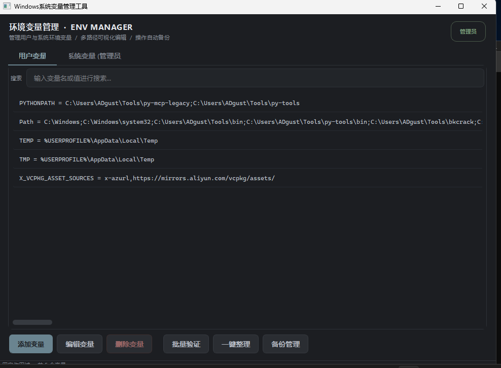
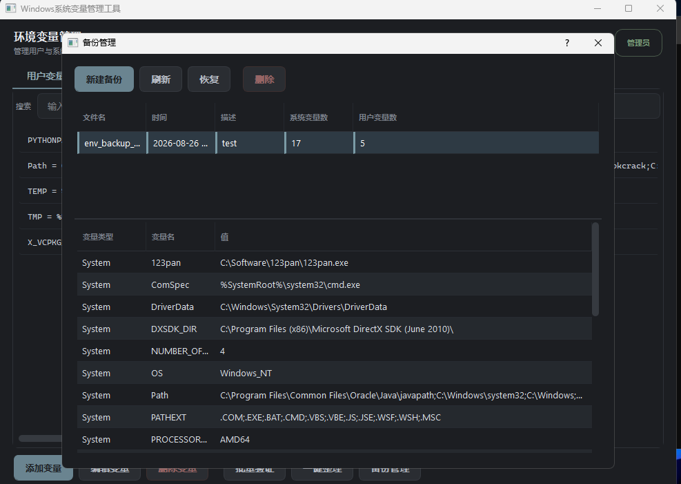

# 环境变量管理工具

一个功能强大的Windows环境变量管理工具，支持用户变量和系统变量的增删改查，以及多路径变量的可视化编辑。

## 功能特性

### 1. 变量管理
- **添加变量**：支持添加用户变量和系统变量
- **编辑变量**：支持编辑变量名和变量值
- **删除变量**：支持删除用户变量和系统变量
- **批量验证**：验证所有变量的有效性
- **一键整理**：按变量名排序变量列表

### 2. 多路径变量编辑
- **可视化编辑**：将多路径变量拆分为列表形式，方便查看和管理
- **路径排序**：支持上移、下移调整路径顺序
- **路径管理**：支持添加、编辑、删除单个路径
- **路径浏览**：支持通过对话框选择文件夹路径

### 3. 备份管理
- **自动备份**：变量操作成功后自动创建备份
- **手动备份**：支持手动创建备份
- **备份恢复**：支持从备份文件恢复环境变量
- **备份删除**：支持删除不需要的备份文件

### 4. 搜索功能
- **实时搜索**：支持按变量名或值搜索变量
- **过滤显示**：只显示符合搜索条件的变量

## 软件截图

### 主界面


### 备份页面


## 技术逻辑

### 架构设计
- **主程序**：`main.py` - 包含主窗口和界面逻辑
- **模块化设计**：
  - `modules/environment_manager.py` - 环境变量管理核心逻辑
  - `modules/registry_handler.py` - Windows注册表操作
  - `modules/backup_manager.py` - 备份管理功能
- **UI组件**：
  - `ui/add_edit_variable_dialog.py` - 添加/编辑变量对话框
  - `ui/backup_manager_dialog.py` - 备份管理对话框
  - `ui/variable_list_widget.py` - 变量列表控件

### 核心功能实现

#### 环境变量操作
- 使用Windows注册表API读取和修改环境变量
- 区分用户变量和系统变量的操作
- 操作成功后自动创建备份

#### 多路径变量编辑
- 将分号分隔的路径字符串解析为列表
- 提供可视化界面进行路径管理
- 支持拖拽调整路径顺序

#### 备份机制
- 使用JSON格式存储备份数据
- 备份文件命名包含操作类型和时间戳
- 支持备份列表查看和恢复

#### 权限管理
- 检测系统变量操作权限
- 提示用户以管理员身份运行程序

## 安装和运行

### 环境要求
- Windows操作系统
- Python 3.6+
- PyQt5

### 安装依赖
```bash
pip install -r requirements.txt
```

### 运行程序
```bash
python main.py
```

## 作者信息

作者：xx

## 注意事项

1. 编辑系统变量需要管理员权限
2. 请谨慎操作环境变量，不当修改可能导致系统异常
3. 建议在进行重要操作前创建手动备份

## 更新日志

### v1.0.6
- 优化了界面布局和交互体验
- 解决了备份问题
- 优化备份管理功能
